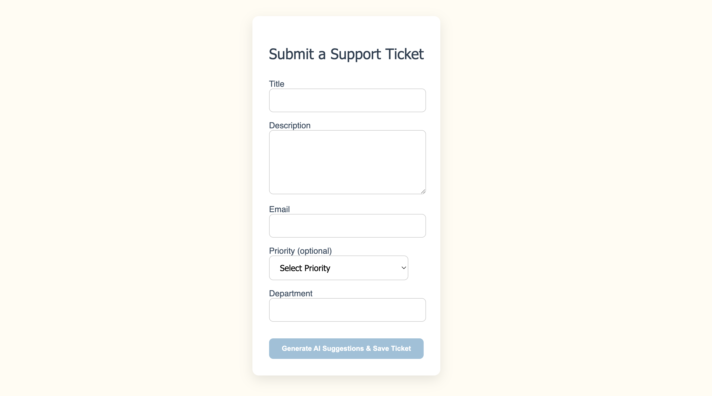
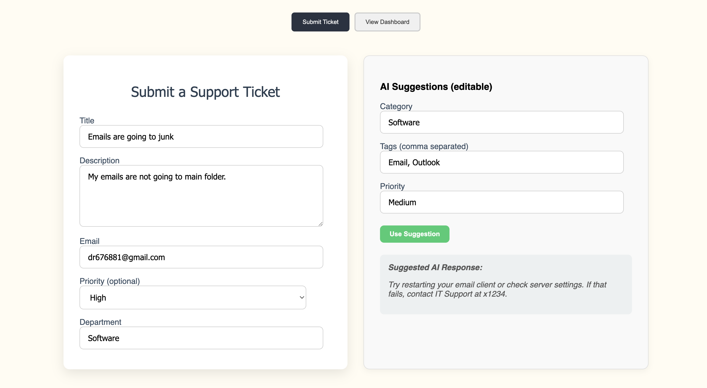
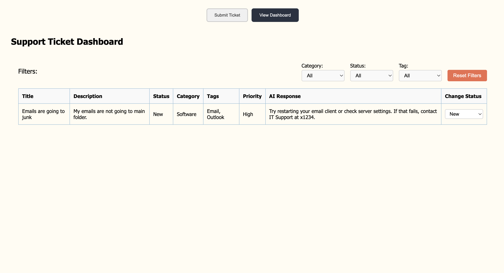
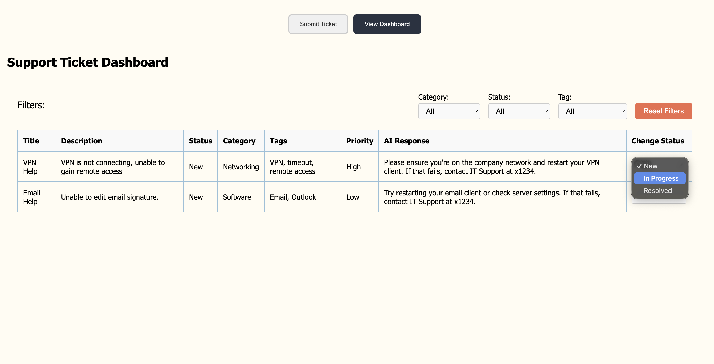
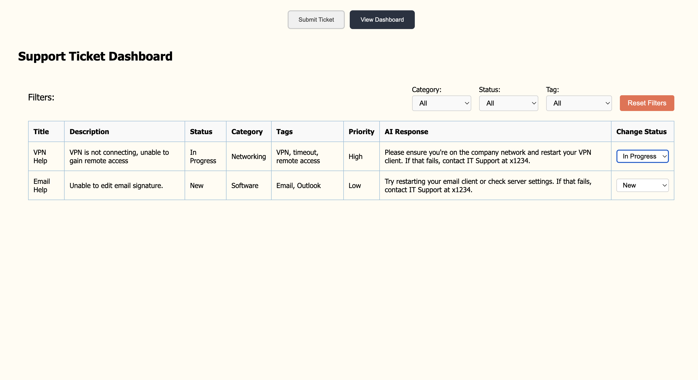
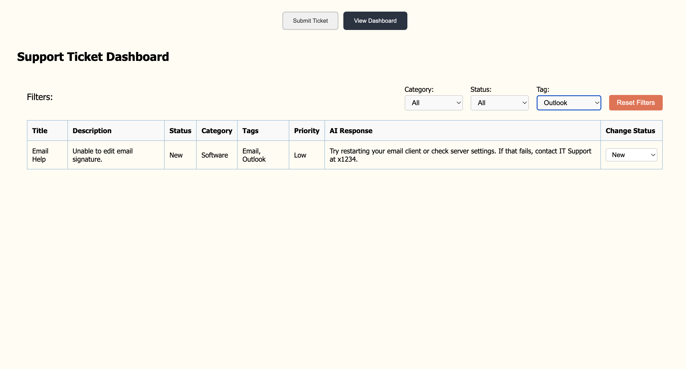
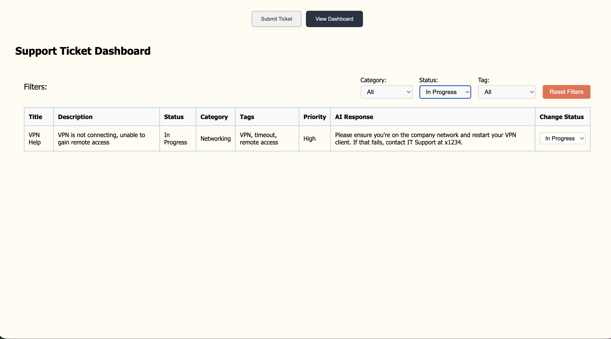

# ticket-system

## Setup instructions

### Backend
```bash
cd server
python -m venv venv
source venv/bin/activate
pip install -r requirements.txt
uvicorn main:app --reload
```
### Frontend: in another terminal window...
```bash
cd client
npm install
touch .env
```

in .env, set VITE_APP_URL to the URL given when you ran "uvicorn main:app --reload", in other words the local host where your backend is running. For example, if your backend is running on (http://localhost:8000) your .env would look like this:

VITE_API_URL=http://localhost:8000

Then, run:

```bash
npm run dev
```

### AI Logic

The AI logic implemented in this prorotype is mocked and fairly simple, but is meant to mimick possible natural language pattern recognition from the tickets and mapping them to possible answers. For example, a ticket that contains "vpn" in the description is likely related to network, remote access, and time outs, as described in the project description, and thus these tags and category labels are returned. An OpenAI API can be connected and called, however that may require expenses beyond the scope of the project.

### Design:

This ticket system implements two main interfaces. The first is a form submission for tickets, taking the Title, Description, Email, optional Priority, Department. Title, description, email, department are all string inputs in the form, while the priority is a drop down select type to ensure there is consistent priority levels across tickets: low, medium, and high. When the form is submitted, it generates an AI suggestion that :

■ Auto-selects a category (e.g., "Network", "Software", "Access")
■ Generates tags from the description
■ Suggests a priority level

This AI suggestion pops up side by side of the ticket to allow for seamless viewing of the suggestion and ticket to properly assess if the suggestion is correct or if it needs editing.

If the suggestion is edited, the "Use suggestion" Button will save the edited suggestion to the proper ticket in database. This button is green to signal that the user is approving of the suggestion being submitted. 

I added a toggle between the ticket form and the ticket dashboard , althought the two pages have different target users and would not be normally linked as they are in this quick prototype.

The second interface is a dashboard of existing tickets. It shows their Title, Description, Status, Category, Tags, Priority, and the AI suggested response. I decided the most organized way to display these tickets was through a table to neatly show each category as a column and allow the support team to swiftly search across tickets. Additionally, the dashboard allows for : 

● Changing status (New, In Progress, Resolved): This was implemented using a select drop down menu to ensure consistency across tickets of the statuses. When a ticket is submitted initially, the status is "new". The support team can then mark them as "in progress" and "resolved". 
● Filtering by category, status, and tag. These filters are a select drop down menu of options, with category and tag having their options mapped from existing categories and tags in the existing tickets. I chose this because alhtough the AI logic is a mock up, with further development open AI or some other hugging face model would be connected, and the categories and tags would not neccesarily be predetermined. With this in mind, I decided it would be ideal to have these options dynamically change as more tickets and their corresponding suggestions are added to the dashboard.

There is a button to clear the filters of the dashboard, colored a red-orange to signal that the user will lose their preset filters when clicked.

This design, with a little more time could be greatly improved by sorting by priority and automatically sending "resolved" tickets to the bottom. This implemenation would allow for the support team to track the tickets they have already resolved without them getting in the way of higher priority or newer tickets.


Note about the CORS Configuration: To make the frontend and backend work together during development and testing, I configured CORS to allow requests from all origins (`allow_origins=["*"]`). This is safe for my purposes but would change if I developed further.

# Screenshots
Ticket Form:



AI Suggestion on Ticket:



Dashboard Showing One Ticket:



Changing Status:




Different Filters Applied:





### Assumptions : 1. For the priority, I am assuming that if there is no priority given, the ai priority applies. If there is priority given, then that priority takes precedence over ai generated priority unless "use suggestion" is clicked. 2. When filtering through tags, I am assuming the filters take tags from existing tickets as the options, not a predetermined set of tags. 3. I am assuming I do not have to check for valid email inputs.

